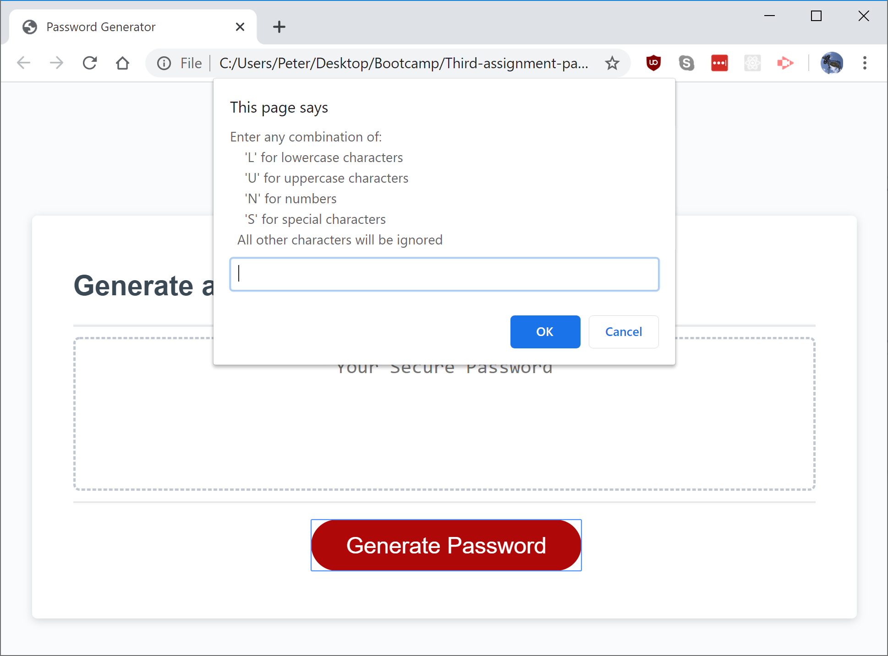
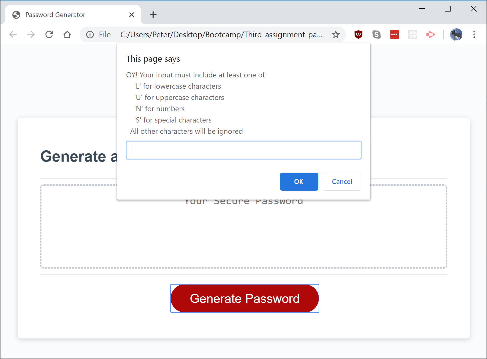
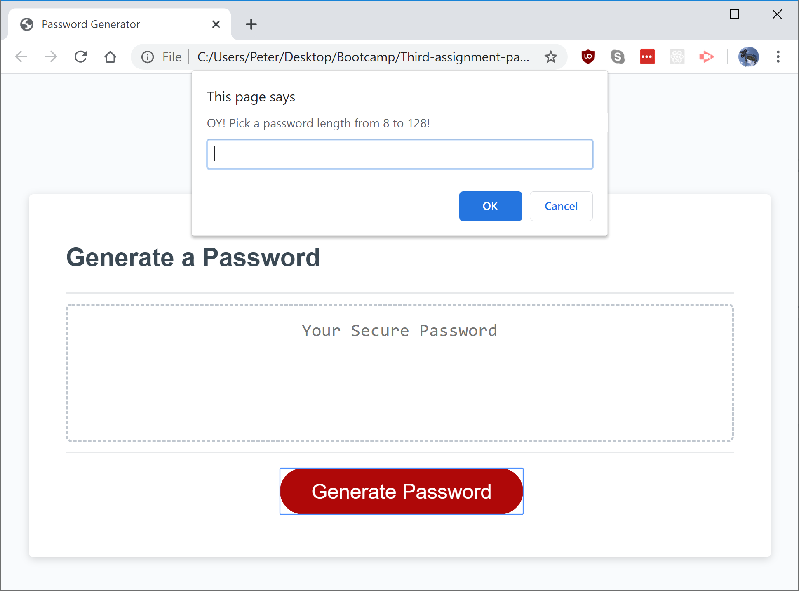
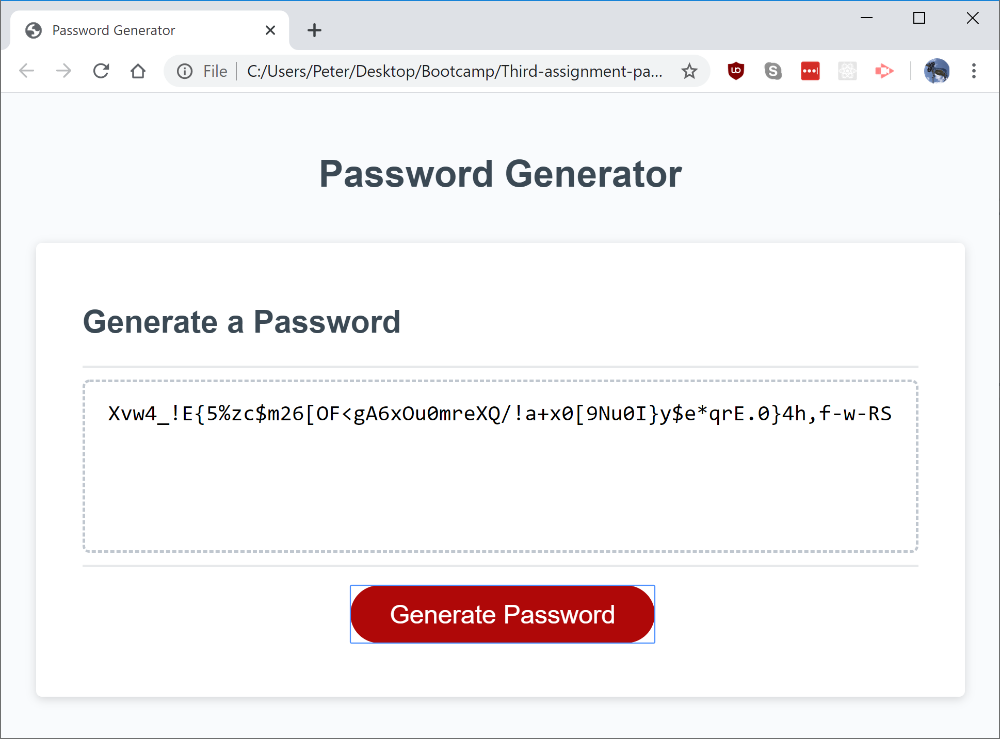

# Assignment 3: Javascript password generator

### An app that generates a password at the length and with character types specified by the user.

The app prompts the user for an input which is parsed for letters corresponding with character types. This is not case-sensitive:

Inputs lacking any valid characters (including empty inputs) are accounted for:

The app asks for a password length:

Invalid entries, such as inputs containing letters, or numbers over/under the range, require a do-over:

If all inputs are valid, a random password is generated with the selected character types at the specified length.

## Live site: https://petertyliu.github.io/Third-assignment-password-generator/index.html
